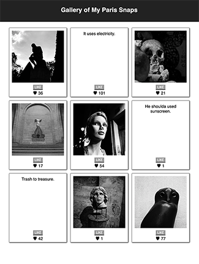

# Weekend React Gallery

## Description

For this weekend assignment, I created a gallery page to share photos. Visitors can toggle between each image and its description as well as click a button to add a "like" to any image.  Current number of likes is held in a database and displayed on-screen for each image.

This app was created using Node, Express, React, Postgres, Postico, and CSS styling.  React components handle looping through the data and the display of each gallery item, so more photos can be added with ease. As a stretch goal, I added SQL database functionality to replace the hardcoded array of gallery items.

[Project Instructions](./INSTRUCTIONS.md)

## Screenshots




## Prerequisites

This app uses React, Redux, Node, Express, and PostgreSQL (a full list of dependencies can be found in `package.json`).

Before you get started, make sure you have the following software installed on your computer:

- [Node.js](https://nodejs.org/en/)
- [PostrgeSQL](https://www.postgresql.org/)
- [Nodemon](https://nodemon.io/)

Using Postico to view and manage the database is recommended.

## Create database and table

Create a new database called `react_gallery` and create a `gallery` table:

```SQL
CREATE TABLE gallery (
	"id" serial PRIMARY KEY,
	"path" varchar(255),
	"description" varchar(255),
	"likes" integer
);
```
and insert the images:

```SQL
INSERT INTO gallery (path, description, likes)
VALUES
('images/thinker.jpg', 'Oh, I know this one! Just give me a minute.', 29),
('images/moulinRouge.jpg', 'It uses electricity.', 99),
('images/catacombs.jpg', 'Uhh, I thought we were going to comb cats...', 13),
('images/nike.jpg', 'Some nice stairs.', 17),
('images/mannequin.jpg', 'Who nose?', 54),
('images/notreDame.jpg', 'He shoulda used sunscreen.', 0),
('images/buttesChaumont.jpg', 'Trash to treasure.', 42),
('images/pantheonCrypt.jpg', 'This guy nose.', 1),
('images/pomponOwl.jpg', 'A striking sil-chouette.', 77);
```

## Install Instructions

- Run `npm install`.
- Start postgres.
- Run `npm run server`.
- Run `npm run client` in a new terminal.
- Navigate to `localhost:3000` in your browser.

## Usage

Click any image to toggle between the photograph and its caption.

Click the "LIKE" button underneath any photo to add 1 to the like counter.

## Contributors
Krystal Frost — [librarykrystal](https://github.com/librarykrystal)

## License
This project is licensed under the MIT License - see the LICENSE.md file for details.

## Acknowledgments
Thanks to Prime Digital Academy, and to the city of Paris for being so photogenic.